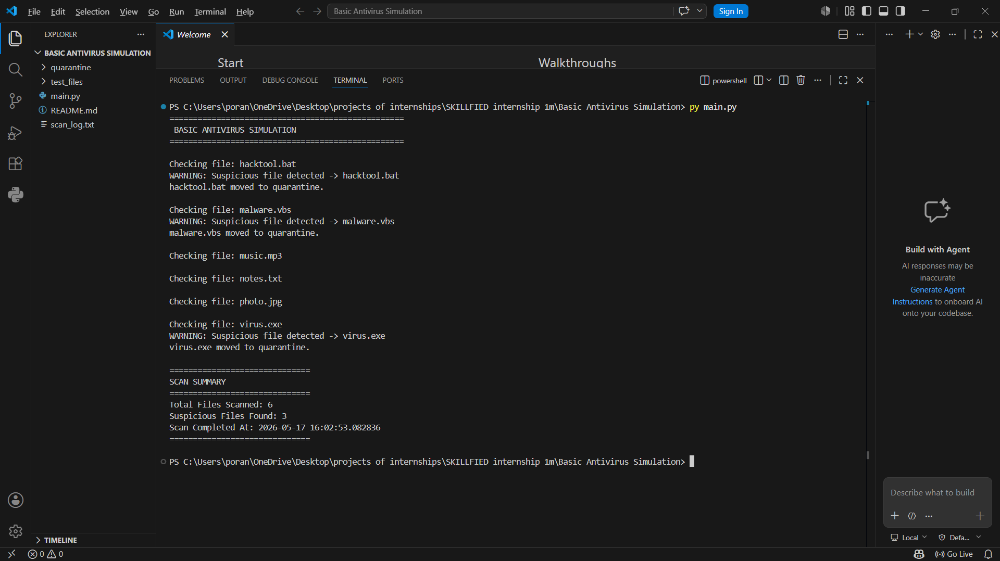
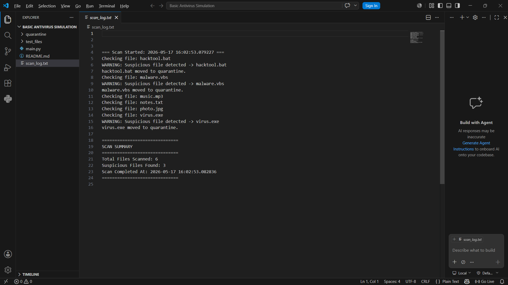
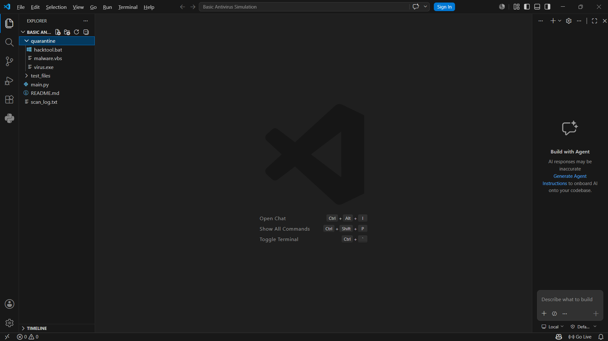

# Basic Antivirus Simulation

## Project Overview
This project is a simple antivirus simulation developed using Python. It scans files in a folder, detects suspicious file extensions, quarantines unsafe files, and stores scan logs with timestamps.

## Features
- File scanning
- Suspicious file detection
- Quarantine system
- Scan logging
- Timestamp tracking
- Scan summary generation

## Technologies Used
- Python
- File Handling
- OS Module
- Logging

## Suspicious Extensions Detected
- .exe
- .bat
- .vbs

## Ethical Note
This project was developed and tested in a safe local environment using dummy files for educational purposes only.

## Screenshots

### Antivirus Scanning

### Scan Logs

### Quarantine Folder

